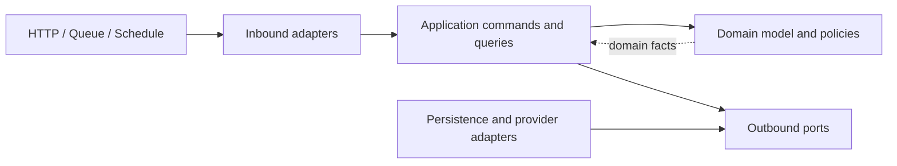
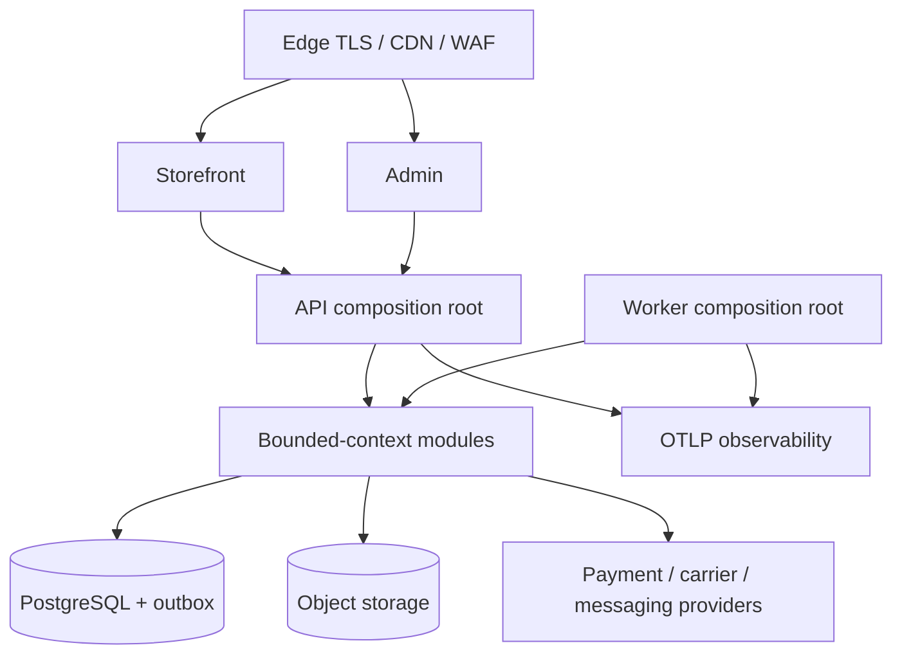

# Architecture Spine — Ecom

## Design Paradigm

Ecom is a DDD bounded-context modular monolith. Each business module is hexagonal: inbound adapters invoke application commands or queries; the application layer coordinates domain behavior through ports; outbound adapters implement persistence and provider ports. Vertical use-case slices live inside this boundary.



## Invariants & Rules

### AD-1 — One owner per business concept

- **Binds:** all modules, entities, commands, policies, and events
- **Prevents:** duplicate models and conflicting mutation paths
- **Rule:** Every business concept has exactly one owning bounded context. Other modules use its published application contract or immutable event contract; they never import its domain, repository, ORM model, or adapter.

### AD-2 — Module data is private

- **Binds:** all PostgreSQL tables and Prisma models
- **Prevents:** shared-database coupling that blocks extraction
- **Rule:** Each table and Prisma model has one owning module. Foreign keys and cascades remain inside that owner boundary. Cross-boundary references are UUIDv7 values without ORM navigation; agreement history uses immutable snapshots. Direct cross-module reads and writes are forbidden.

### AD-3 — Owners mutate through commands

- **Binds:** HTTP, jobs, schedules, provider callbacks, and operator actions
- **Prevents:** business rules being bypassed by adapters
- **Rule:** State changes enter through an idempotent command handled by the owning module application layer. Controllers, consumers, schedules, and provider adapters cannot write repositories directly. Every command carries actor, correlation, causation, and idempotency context.

### AD-4 — Cross-module consistency uses outbox events

- **Binds:** all cross-module workflows and external side effects
- **Prevents:** partial commits and assumed exactly-once delivery
- **Rule:** The owner commits business state and a versioned outbox event in one PostgreSQL transaction. Delivery is at least once. Consumers maintain an inbox or equivalent idempotency record; no consumer assumes event order across aggregates.

### AD-5 — Commerce truths remain separate

- **Binds:** FR-22..FR-36 and PRD §4.5.1
- **Prevents:** one overloaded status controlling money, stock, and physical work
- **Rule:** Orders owns the commercial snapshot and Order lifecycle; Payments owns provider evidence, Payment state, reconciliation, and Refund execution; Inventory owns Stock Position and reservations; Fulfillment owns work and Shipment state; Returns owns Return Request decisions. Checkout is a process manager and owns none of those truths.

### AD-6 — Inventory reservations are explicit

- **Binds:** FR-12, FR-22, FR-31, FR-33, Inventory, Checkout, Orders
- **Prevents:** oversell and double release under retries
- **Rule:** Inventory exposes reserve, confirm, and release commands keyed by Order and line. It checks `available >= requested` and creates the reservation atomically with row serialization or conditional version update, and enforces nonnegative availability in the database. Confirm, expire, adjust, and release use conditional state/version transitions and are idempotent; distinct-command concurrency tests are mandatory. Only Inventory mutates Stock Position.

### AD-7 — Search is a disposable projection

- **Binds:** FR-15..FR-19, NFR-3, NFR-11
- **Prevents:** search state becoming catalog truth
- **Rule:** Discovery owns a rebuildable PostgreSQL search and commercial-visibility projection fed by Catalog, Content, Pricing, and Inventory facts. It projects the canonical `PurchaseEligibility.v1` outcomes and reason codes owned by Checkout and must pass the same conformance fixtures. Non-safety lag requires an LG-5 SLO; every public result also passes AD-22 safety denial. Checkout re-evaluates eligibility against owner truth. A dedicated engine replaces only the Discovery adapter after an accepted bottleneck record.

### AD-8 — Regulated publication is fail-closed

- **Binds:** FR-1..FR-11, CR-1..CR-6
- **Prevents:** incomplete evidence or unsupported claims becoming public
- **Rule:** Catalog owns SKU evidence and approved Product claims; Content owns versioned Editorial and Advertising pages. Each published Content Version records canonical evidence, Approved Claim, Disclaimer, reviewer, advertising-classification, and human-approval IDs and versions; AI cannot approve or publish regulated claims. Catalog withdrawal commits its AD-22 denial in the same transaction; outbox events clean projections and caches asynchronously. Public Product evidence and SEO content render visible without client JavaScript.

### AD-9 — Providers sit behind owner ports

- **Binds:** Payments, Fulfillment, Engagement, LG-3
- **Prevents:** provider payloads and states leaking into core domains
- **Rule:** Payment, carrier, and messaging integrations implement owner-defined ports and map provider data to internal contracts; LG-3 selects the launch providers and channels. Hosted or redirected Payment UI is mandatory. Only verified server-to-server evidence changes Payment state; browser returns are informational; prohibited account data never enters Ecom storage, logs, or analytics.

### AD-10 — External contracts are versioned

- **Binds:** public HTTP surfaces, internal events, and webhooks
- **Prevents:** independently built consumers choosing incompatible shapes
- **Rule:** Storefront/Admin-facing HTTP APIs use `/api/v1`, OpenAPI 3.2.0, RFC 9457 problem details, cursor pagination, UTC ISO 8601 timestamps, and integer VND minor units; this is not a public developer product. Event and webhook schemas are immutable within a version; breaking changes create a new version. Webhooks require signature verification, replay defense, and idempotency.

### AD-11 — Authorization and audit are server-side

- **Binds:** FR-2, FR-6, FR-9, FR-29, FR-35, FR-36, FR-41..FR-44
- **Prevents:** UI visibility from becoming the security boundary and audit from rewriting source state
- **Rule:** The owning application-command boundary enforces capability and resource authorization for every HTTP, Worker, schedule, event, provider, human, and service actor. System actors are least-privilege identities; verified provider evidence authorizes only its mapped command. Modules emit auditable facts; Governance stores append-only audit evidence and privacy workflows but cannot mutate another module's business record. Sensitive actions require actor, reason, outcome, and correlation identifier.

### AD-12 — One release train, independently scalable processes

- **Binds:** Storefront, Admin, API, Worker, NFR-11
- **Prevents:** accidental microservices and version skew
- **Rule:** Storefront, Admin, API, and Worker build from one monorepo commit and one compatibility version. API and Worker use the same module packages and migrations. All processes are stateless; sessions, schedules, idempotency, uploads, and jobs use shared durable stores. Processes may scale independently, but provider contracts, databases, and deployment cadence do not make them independent services.

### AD-13 — Production evidence gates release

- **Binds:** NFR-3..NFR-12 and LG-1..LG-7
- **Prevents:** architecture claims without operational proof
- **Rule:** Every PRD gate preserves its blocking effect: LG-1 precedes catalog seeding and forecast; LG-2 precedes publication and sellability; LG-3 precedes provider-specific stories and production Checkout; LG-4 precedes end-to-end acceptance and production Orders; LG-5 and LG-6 precede production approval; LG-7 precedes public launch. Required evidence includes capacity, restore, provider replay, Order-to-Refund rehearsal, correlation-based alerts, OWASP ASVS 5.0.0 evidence with version-qualified requirement IDs, security/privacy review, and no unresolved critical or high launch-surface finding. Logs and traces exclude payment and health-sensitive data.

### AD-14 — Extraction is bottleneck-led strangulation

- **Binds:** Search, Payments, Inventory, NFR-11
- **Prevents:** service count becoming a maturity target
- **Rule:** A module may be extracted only with an accepted bottleneck record, stable owned contract, independent data migration plan, shadow or dual-read validation, cutover metric, and rollback. Discovery/Search, Payments, and Inventory are unordered candidates until measured evidence selects one.

### AD-15 — Architecture is executable

- **Binds:** CI and every module change
- **Prevents:** dependency and contract rules degrading into prose
- **Rule:** Automated checks enforce import boundaries, public-contract compatibility, table/object ownership, event-schema compatibility, prohibited adapter-to-repository mutation, all-adapter authorization, provider replay, concurrent Stock/Refund invariants, upload quarantine/safe-delivery behavior, registered purpose/retention values, denied sensitive-data consumers/joins, complete AD-20 owner contracts, required-route WCAG/contrast/keyboard evidence, and launch-gate artifact links in a versioned evidence manifest. A structural exception requires an Architecture Decision update before merge.

### AD-16 — Agent work follows bounded ownership

- **Binds:** Supervisor, Leads, Peers, BR, BV, Srcwalk, UBS
- **Prevents:** parallel agents editing shared internals or silently changing contracts
- **Rule:** Supervisor owns gates, release class, and dependency policy; Leads own context groups and published contracts; a Peer owns one story inside one module. Launch-essential work may gate the first controlled sale. Evidence-triggered follow-ons may not gate it unless LG-4 requires them; Later work requires a PRD scope decision. Cross-module work requires an explicit contract issue and Lead review. BR is the task/dependency authority, BV is its read-only graph view, Srcwalk precedes structural changes, and UBS scans changed code before handoff.

### AD-17 — Dependency versions are accepted at scaffold

- **Binds:** toolchain and runtime dependencies
- **Prevents:** a dated architecture seed overriding patched releases or the lockfile
- **Rule:** The Stack table records versions verified from official sources on 2026-08-25. Scaffolding must re-verify security and compatibility, pin exact versions in the lockfile, and record accepted replacements. TypeScript 6.0.3 is a compatibility hold until a TypeScript 7 build/test spike passes. The lockfile and runtime manifests then supersede this seed.

### AD-18 — Sensitive behavior is purpose-bound

- **Binds:** CR-7, FR-19, FR-43, FR-45, analytics, Discovery, Engagement, Reporting
- **Prevents:** commerce and search behavior becoming an undeclared health-interest profile
- **Rule:** Producers minimize sensitive query and behavior data before emitting it and attach an approved purpose and retention class. Reporting, Discovery, and Engagement consume only purpose-allowed fields and joins. Advertising, audience building, or automated Product selection is denied by default unless Governance records a validated lawful basis and an explicit Product decision; erasure, anonymization, and hold outcomes propagate to derived models.

### AD-19 — Merchant, finance, and invoice authorities are explicit

- **Binds:** Legal Seller, Offers, Orders, Payments, Refunds, settlement, invoices, FR-29, FR-44, FR-46
- **Prevents:** User, Payment reconciliation, Reporting, or a generic seller field becoming fiscal truth
- **Rule:** Merchant owns the Legal Seller party and versioned `MerchantPartySnapshot`. Pricing Offers reference `merchantPartyId`; Orders captures one accepted snapshot version at commitment and carries it into Finance and invoice commands. Finance owns the authoritative append-only financial ledger, provider-settlement postings, electronic-invoice records/evidence, reversals, and accounting export. Payment `FinancialFact` includes posting identity, attempt/provider transaction, Order, currency, gross, fee, net, effective time, settlement reference, original-posting reference, and allocations; Finance alone maps it to ledger entries. Payment reconciliation is operational evidence, never the ledger. Marketplace onboarding, liability, commissions, and seller settlement remain deferred.

### AD-20 — Governance coordinates owner-held evidence

- **Binds:** FR-42..FR-44, CR-9, privacy requests, retention, legal hold, authority response
- **Prevents:** privacy or authority workflows bypassing ownership or becoming impossible across private modules
- **Rule:** Governance owns consent, processor/transfer registers, privacy cases, legal holds, and authority-response cases. The shared case envelope carries case ID, subject selectors, basis, scope, operation, deadline, owner acknowledgement, partial/terminal status, retained-with-basis result, evidence digest, retry state, and completion rule. Every data owner implements discover, export, correct, erase or anonymize, hold, and evidence-result contracts. Governance records approval and an integrity manifest; legal obligations may override deletion only with a recorded basis, disposition, and audit trail.

### AD-21 — Frontend semantics outrank generated styling

- **Binds:** NFR-1..NFR-3, PRD §5.3, Storefront, Admin, `packages/ui`
- **Prevents:** inaccessible forks, breakpoint-specific content drift, hidden SEO content, and page-local token systems
- **Rule:** Authority order is PRD accessibility/compliance/responsive outcomes, approved page specification, approved global tokens, then generated design candidates. `packages/ui` owns semantic roles and keyboard, focus, error, and reduced-motion behavior; applications compose rather than fork them. Each route has one semantic content/disclosure source across 375, 768, 1024, and 1440 px. Animation is progressive enhancement and cannot hide public content, Product evidence, disclosures, or primary navigation before hydration. Automated WCAG/contrast checks and primary-journey keyboard evidence participate in AD-13 and AD-15.

### AD-22 — Purchase eligibility and safety denial are canonical

- **Binds:** Catalog, Pricing, Inventory, Discovery, Checkout, Engagement
- **Prevents:** public visibility, Notification, and Checkout applying different sellability rules
- **Rule:** Checkout owns `PurchaseEligibility.v1`: versioned Catalog eligibility, Offer validity, Inventory availability, policy-limit inputs; deny-first evaluation in that order; stable outcome and reason codes; shared conformance fixtures. Discovery projects that contract and Checkout evaluates it against owner truth. Separately, Catalog owns a synchronously queried Safety Denial Registry committed with regulatory withdrawal. Every public Product/Content response and outbound Product Notification queries it and fails closed on denial, timeout, or unavailability; outbox events only clean derived state.

### AD-23 — Checkout alone orchestrates Order commitment

- **Binds:** Checkout, Inventory, Orders, Payments, FR-22..FR-30
- **Prevents:** orphan reservations, mismatched identifiers, and competing Payment-to-Order transitions
- **Rule:** Checkout allocates Order/line UUIDv7 IDs, obtains an immutable quote and Merchant snapshot, reserves Inventory against those IDs, creates one `Pending Payment` Order with the same IDs/snapshots/reservation, then initiates Payment. Checkout alone translates verified Payment facts into expected-version Order and Inventory commands: success confirms the nonterminal Order and reservation; failed/canceled/timeout cancels the pending Order and releases once. Success after a terminal cancellation never reopens or holds the Order: Payments creates a reconciliation exception, Fulfillment remains blocked, and the approved corrective Refund or audited correction path runs. Other contradictory or partially applied nonterminal evidence enters `On Hold`. Other modules observe and cannot issue competing lifecycle commands.

### AD-24 — Refund calculation and execution are separated

- **Binds:** Returns, Orders, Payments, Finance, FR-33..FR-35
- **Prevents:** duplicate allocation and inconsistent partial Refund totals
- **Rule:** A canonical `RefundApproval` carries source, reason, evidence, actor/authority, eligible lines/charges, and idempotency identity. Authorized sources are Returns for post-fulfillment returns, Orders for policy-approved pre-fulfillment cancellation, and Payments Reconciliation plus an authorized Operator for success-after-terminal-cancel or provider correction. Orders alone converts approval into `ApprovedRefundInstruction` from immutable Order/policy snapshots, including allocations, delivery/tax/discount adjustments, currency, cap, prior Refund total, and original financial references, and atomically reserves refundable entitlement using aggregate versioning or serialization. Payments executes only that instruction exactly once and independently enforces `captured − refunded − in-flight authorized` as a transactional cumulative cap. Finance posts the unique resulting fact and any invoice adjustment.

### AD-25 — Commands, events, and migrations evolve compatibly

- **Binds:** all commands, events, jobs, Prisma migrations, API and Worker rollout
- **Prevents:** key reuse, poison events, and old/new process-schema incompatibility
- **Rule:** Command identity is `(owner, commandType, callerOrSubject, key)` plus canonical request hash: same hash replays the original result; a different hash returns a stable conflict; retention spans the business retry/reconciliation horizon. Event rollout is consumer-before-producer with dual-read or dual-publish compatibility; queued versions remain decodable until drain evidence. Platform owns PostgreSQL extensions/global objects and migration order; module objects are owner-prefixed. Rolling deploys use expand/migrate/contract across at least one release, test clean and previous-production schemas, drain old Worker leases/messages, and contract destructively only after old processes and rollback need are gone.

### AD-26 — Binary objects retain domain ownership

- **Binds:** Catalog evidence/media, Content media, Review media, Governance holds/exports
- **Prevents:** shared buckets becoming unowned public mutable storage
- **Rule:** Each object and metadata record has one source-module owner, an opaque owner-prefixed key, and private-by-default access through owner ports. Uploads remain quarantined until allowlisted size/type, server-side MIME and magic-byte validation, malware scan, and required raster/transcode complete. Untrusted SVG, HTML, and PDF are never inlined; safe views/downloads use an isolated origin, restrictive CSP, `nosniff`, and safe `Content-Disposition`. Regulatory originals remain immutable and versioned. The owner implements authorization, signed delivery, erase, legal hold, retention, and evidence export through AD-20; platform storage adapters own no business lifecycle.

### AD-27 — Storefront has one shell

- **Binds:** Home, Category/Search, Product Detail, Editorial Content, Cart/Checkout, Account
- **Prevents:** route epics forking navigation, disclosures, Cart/account state, and cache behavior
- **Rule:** `apps/storefront` owns one shell contract and implementation for trust/header, search/category navigation, contextual Cart/account access, content slots, and compliance/policy footer. Route epics supply slot content and page composition through that contract; they cannot reimplement global regions or their data loaders.

### AD-28 — Cross-module contracts need bilateral acceptance

- **Binds:** Supervisor, Leads, Peers, BR dependencies, published contracts
- **Prevents:** producer and consumer stories merging locally valid but incompatible contracts
- **Rule:** The producer Lead owns the canonical contract. Every affected consumer Lead records compatibility acceptance or a blocking objection with tests. BR carries producer-to-consumer dependency and rollout tasks. The Supervisor resolves conflict and alone approves a breaking exception before either side merges.

### AD-29 — Infrastructure choice precedes provisioning

- **Binds:** environment, CI/CD, data residency, backup, telemetry, managed-service stories
- **Prevents:** parallel infrastructure work selecting incompatible providers or regions
- **Rule:** An Architecture-owned LG-5 precursor blocks environment and CI/CD provisioning until an accepted deployment decision records cloud and region, runtime, managed-service classes, Vietnamese data-residency fit, backup/restore compatibility, cost envelope, operational owner, and exit assumptions. LG-3 separately governs commerce and messaging providers.

## Bounded-Context Ownership

| Context | Owns | Published surface |
| --- | --- | --- |
| Identity | User, credential, session, role assignment | identity queries, actor context, authorization facts |
| Merchant | Legal Seller party, verification, registrations | merchant-party identity and evidence facts |
| Content | Editorial Page, Advertising Page, content version, publication workflow | published content queries and lifecycle events |
| Catalog | Product, Variant, category, brand, regulatory evidence, approved claim | product/evidence queries and catalog events |
| Inventory | Stock Position, reservation, adjustment | reserve/confirm/release commands and availability events |
| Pricing | Offer, price list, coupon, promotion | quote and validation contracts; price events |
| Discovery | search index and combined commercial-visibility projection | search/filter queries, fail-closed tombstones, purchasability events |
| Cart | Cart and Cart Item | cart commands and checkout input snapshot |
| Checkout | Checkout Session and process state | checkout orchestration commands and status |
| Orders | Order, Order Item, commercial and policy snapshots | Order commands, queries, and lifecycle events |
| Payments | Payment, provider transaction evidence, reconciliation entry, Refund execution | payment/refund commands and financial facts |
| Finance | financial ledger, settlement posting, invoice record/evidence, accounting export | idempotent postings, reversals, invoice and ledger queries |
| Fulfillment | Fulfillment work, Shipment, tracking milestone | pick/pack/dispatch commands and shipment events |
| Returns | Return Request, eligibility decision, disposition | return commands and approved-refund request |
| Engagement | Review, Back-in-stock Subscription, Notification template/attempt, restricted customer service note | moderation, subscription, restricted support-note commands, delivery outcomes |
| Governance | Audit Entry, Legal Policy Version, consent, processor/transfer register, privacy/hold/authority case | policy queries, audit intake, scoped evidence and privacy coordination |
| Reporting | purpose-bound acquisition and operational read models | read-only reports and exports; never ledger truth |

## Consistency Conventions

| Concern | Convention |
| --- | --- |
| IDs | UUIDv7 in PostgreSQL; never expose sequential database IDs |
| Time | UTC in storage and contracts; locale conversion at presentation edges |
| Money | Integer minor units plus ISO 4217 currency code; VND for MVP |
| Commands | Imperative names; idempotency key required for retryable or side-effecting commands |
| Events | Lowercase kebab-case, past tense, owner-prefixed; immutable versioned envelope |
| Event envelope | `eventId`, `eventType`, `occurredAt`, `producer`, `aggregateId`, `schemaVersion`, `correlationId`, `causationId`, `payload` |
| Regulated references | `evidenceId/version`, `claimId/version`, `disclaimerId/version`, `reviewerId`, `approvalDecisionId/version`, `advertisingClass` |
| Errors | RFC 9457 with stable owner-prefixed problem type and correlation identifier |
| Pagination | Opaque cursor; stable ordering with UUIDv7 tie-breaker |
| Database | One owner per table; one schema file per module; one ordered migration pipeline |
| Prisma runtime | ESM, `@prisma/adapter-pg`, explicit pool limits, transaction timeout, and connection timeout |
| Configuration | Validated environment variables at process start; secrets only from the runtime secret provider |
| Observability | Structured logs, metrics, and OTLP traces with correlation; redact prohibited data |
| Cache | Cache derived reads only; owner event invalidates; authoritative commands never depend on cached truth |
| Read replicas | Deferred; if adopted, owner-approved or derived reads only under an accepted staleness budget |

## Stack

| Name | Version |
| --- | --- |
| Node.js LTS | 24.19.0 |
| pnpm | 11.24.0 |
| TypeScript compatibility hold | 6.0.3; move to 7.0.2 after the monorepo build/test spike passes |
| Next.js Active LTS security baseline | 16.3.3; scaffold pins the latest patched stable 16.x |
| NestJS | 11.2.3 |
| Prisma ORM | 7.10.0 with ESM and `@prisma/adapter-pg`; do not allow `latest` to select another major |
| PostgreSQL | 18.6 |

## Structural Seed

```text
ecom/
  apps/
    storefront/             # public Next.js surface and single shared shell owner
    admin/                  # operator Next.js surface
    api/                    # NestJS HTTP composition root
    worker/                 # NestJS outbox and durable-job composition root
  modules/
    <context>/
      src/contracts/        # only cross-module import surface
      src/application/      # commands, queries, ports, process managers
      src/domain/           # aggregates, value objects, policies
      src/adapters/         # Prisma, provider, queue implementations
  platform/
    database/prisma/schema/ # one owner-named schema file per module
    messaging/              # outbox, inbox, event envelope
    observability/          # logging, metrics, tracing, redaction
    security/               # authentication primitives and policy plumbing
  packages/
    ui/                     # accessible visual primitives; no domain behavior
    config/                 # shared compile/lint/test configuration
  tests/
    architecture/           # boundary and ownership checks
    contracts/              # API, event, and provider compatibility
    system/                 # end-to-end commerce and replay scenarios
```



Deployment environments are local, test, staging, and production. Production runs immutable stateless containers for Storefront, Admin, API, and Worker near Vietnamese users. The Worker leases PostgreSQL outbox and durable-job records. PostgreSQL, object storage/CDN, secrets, backups, and telemetry are managed capabilities; the cloud vendor is not fixed by this spine.

## Capability → Architecture Map

| Capability / Area | Lives in | Governed by |
| --- | --- | --- |
| Governed CMS and SEO, FR-1..FR-7 | Content, Catalog, Discovery, Storefront | AD-1, AD-7, AD-8, AD-21 |
| Regulated Catalog, FR-8..FR-14 | Merchant, Catalog, Inventory, Pricing | AD-1, AD-2, AD-6, AD-8, AD-19 |
| Discovery, FR-15..FR-19 | Discovery, Storefront | AD-7, AD-8, AD-18, AD-21 |
| Identity, Cart, Checkout, FR-20..FR-27 | Identity, Cart, Pricing, Checkout, Orders | AD-3..AD-6, AD-10, AD-21 |
| Payment and reconciliation, FR-28..FR-30 | Payments, Finance, Orders, Checkout | AD-4, AD-5, AD-9, AD-19 |
| Fulfillment and Shipment, FR-31..FR-32 | Inventory, Fulfillment | AD-4..AD-6, AD-9 |
| Cancellation, returns, Refund, holds, FR-33..FR-36 | Orders, Returns, Payments, Finance, Catalog, Fulfillment | AD-3..AD-6, AD-8, AD-19 |
| Reviews, support, Notifications, FR-37..FR-40 | Engagement, Orders, Discovery | AD-1, AD-4, AD-7, AD-9, AD-11 |
| RBAC, audit, privacy, policy, finance, reporting, FR-41..FR-46 | Identity, Merchant, Finance, Governance, Reporting | AD-10, AD-11, AD-18..AD-20 |
| Performance, security, reliability, NFR-1..NFR-12 | all processes, UI surfaces, and platform adapters | AD-12, AD-13, AD-15, AD-17, AD-21 |
| Release sequencing | all BR epics and stories | AD-13, AD-16 |
| Future extraction | Discovery adapter, Payments, Inventory | AD-2, AD-4, AD-14 |

## Deferred

- Exact cloud, region, container platform, managed database, cache, object-storage, CDN, secret, and telemetry vendors: decide through AD-29 before environment or CI/CD provisioning.
- Exact Payment, carrier, and messaging channels/providers: decide through LG-3 capability and sandbox evidence.
- Next.js patch within supported stable 16.x: re-verify at scaffold and never downgrade below the 16.3.3 security baseline.
- Prisma 7.10.0 acceptance: close after ESM build, driver-adapter pool/timeout, migration, transaction-timeout, and PostgreSQL 18.6 compatibility spikes.
- TypeScript 7.0.2 adoption: close after Next.js, NestJS, Prisma, lint, build, and test compatibility evidence; TypeScript 6.0.3 is the temporary hold.
- Domain-specific retention periods and archive tiers: close through LG-2/LG-4 before production data exists.
- Redis caching, BullMQ, or another broker: adopt only after accepted cache, job-throughput, scheduling, or horizontal-worker evidence; PostgreSQL outbox/jobs are the MVP baseline.
- Read replicas: adopt only after measured database-read pressure; route only owner-approved or derived reads within an accepted staleness budget, never authoritative command or Checkout validation.
- Dedicated search engine, separate service databases, event broker, data warehouse, multi-region, marketplace, multi-warehouse, medicine, and public API: outside MVP; require a new architecture decision and PRD scope change.
- Approved UX specifications for Home, Category/Search, Product Detail, Editorial Content, Cart/Checkout, Account, and Admin: required before implementation of each surface. Page specifications may override approved global tokens but cannot weaken AD-21 or PRD outcomes.
