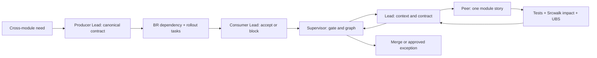

# Supervisor–Lead–Peer Delivery Topology

This companion maps the architecture boundaries to a Paseo/Pi-style team so parallel agents can deliver without shared-state drift. `ARCHITECTURE-SPINE.md` is authoritative over this companion and every story.

## Roles

| Role | Owns | May approve | Must not do |
| --- | --- | --- | --- |
| Supervisor | PRD and architecture gates, release scope, BR dependency graph, and final acceptance | cross-module contract conflicts, gate closure, and release decisions | assign two owners to one concept or waive an AD without a recorded exception |
| Lead | one context group, its contracts and integration plan, and reviewer assignments | stories inside the group and compatible contract changes | expose module internals or merge an unresolved cross-context change |
| Peer | one ready story in one module, plus that story's tests and evidence | local implementation choices allowed by the spine | edit another module's internals or expand story scope |

## Lead Assignment Map

| Lead group | Accountable modules | Accountable shared surfaces | Accountable requirements/decisions | Supporting seams |
| --- | --- | --- | --- | --- |
| Growth and Trust | Merchant, Content, Catalog, Pricing, Discovery, Engagement | `apps/storefront`, `packages/ui` | FR-1..FR-11, FR-15..FR-19, FR-37..FR-40; CR-1..CR-6; LG-1..LG-2; AD-7, AD-8, AD-18, AD-21, AD-27 | Checkout UI composition, AD-22 eligibility fixtures, and AD-26 binary-object ownership |
| Commerce | Cart, Checkout, Orders, Payments, Finance | none | FR-20..FR-30, FR-33, FR-35; LG-3..LG-4; AD-5, AD-19, AD-22..AD-24 | Fulfillment/Returns commands, FR-44 policy snapshots, and FR-46 financial facts |
| Operations | Inventory, Fulfillment, Returns | none | FR-12..FR-14, FR-31..FR-32, FR-34, FR-36; AD-6 | FR-33 cancellation inputs, FR-35 Refund inputs, and LG-4 rehearsal |
| Platform and Governance | Identity, Governance, Reporting | `apps/admin`, `apps/api`, `apps/worker`, `platform/*`, `packages/config`, `tests/*` | FR-41..FR-46; NFR-1..NFR-12; CR-7..CR-9; LG-5..LG-7; AD-1..AD-4, AD-9..AD-17, AD-20, AD-25..AD-26, AD-28..AD-29 | all groups' contracts, evidence manifests, deployment, and release gates |

Each module and shared surface has one accountable Lead group. A supporting seam permits contribution but does not transfer contract, data, or merge authority.

## Work Intake

| Release class | Intake rule |
| --- | --- |
| Launch-essential | Supervisor may place the work on the critical path when PRD dependencies and relevant LG prerequisites are explicit in BR. |
| Evidence-triggered follow-on | The Supervisor admits this work only when the PRD evidence trigger fires or LG-4 requires it. Otherwise, the work cannot delay the first controlled sale. |
| Later | Requires an approved PRD scope change and any required Architecture Decision before BR decomposition. |

## Tool Policy

| Tool | Use |
| --- | --- |
| BR | create and update epics, stories, dependencies, owners, release class, and gate evidence |
| BV | read-only triage of ready, blocked, and high-impact work |
| Srcwalk | repository map, structural navigation, dependency and impact checks |
| UBS | changed-code bug and security scan before handoff; not a planning-document gate |

## Work Contract

1. The Supervisor creates BR epics for launch-essential capabilities and records LG dependencies.
2. The Lead decomposes each epic into stories. Each story names one owning module, cites applicable `AD-n` rules, defines acceptance evidence, and identifies every published contract it touches.
3. BV is used to select ready work; it never replaces BR as the write authority.
4. Peer runs Srcwalk before a structural change, edits only the named module and approved contract surfaces, adds tests, then runs UBS on changed code.
5. For every cross-module shape change, create a separate contract issue. The producer Lead owns the canonical contract. Every affected consumer Lead records compatibility acceptance or a blocking objection, and BR records the producer-to-consumer dependency and rollout tasks.
6. The Supervisor resolves contract conflict and alone approves a breaking exception before merge. Release acceptance still requires evidence that dependencies and launch gates are satisfied.

## Story Handoff Minimum

- BR issue key, owner module, Lead group, and dependency keys.
- PRD requirement IDs and `AD-n` citations.
- Commands, queries, events, or API contracts changed.
- Producer Lead, each consumer Lead's acceptance or blocking objection, compatibility window, and BR rollout dependencies for every cross-module contract.
- Migration ownership and backward-compatibility statement.
- Tests executed and results, Srcwalk impact findings, UBS results, and residual risk.
- Launch-gate evidence affected or produced.
